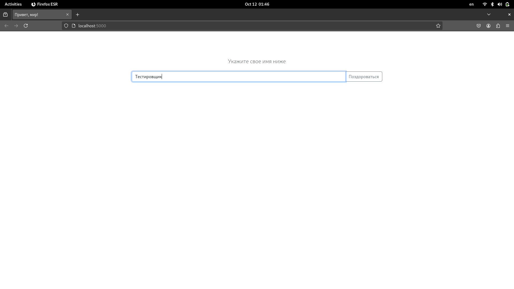
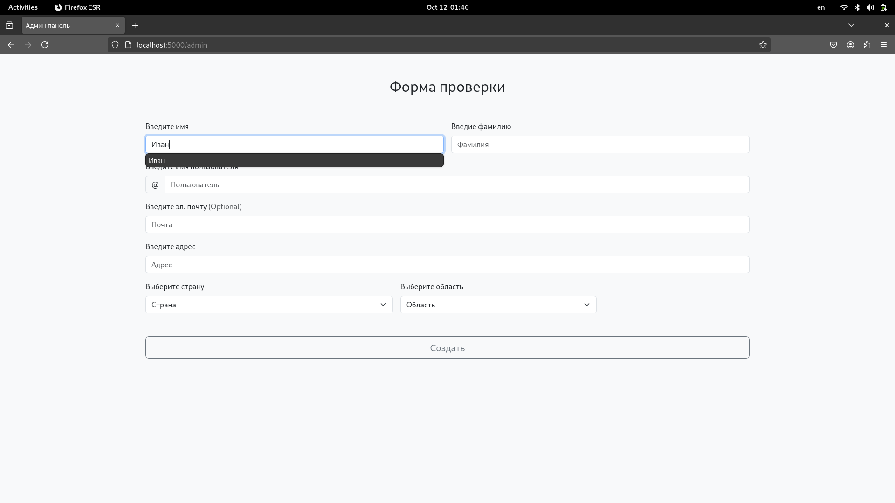
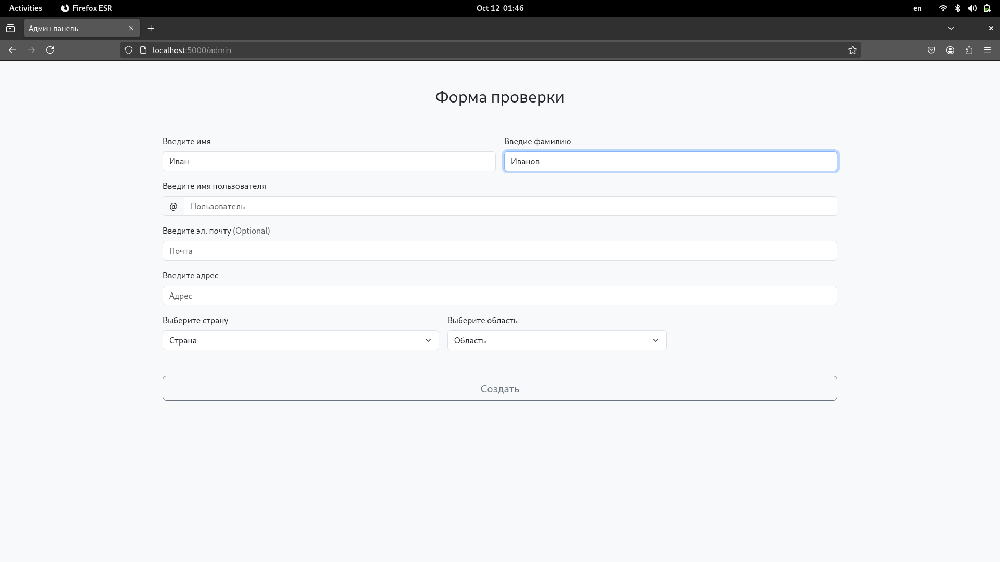
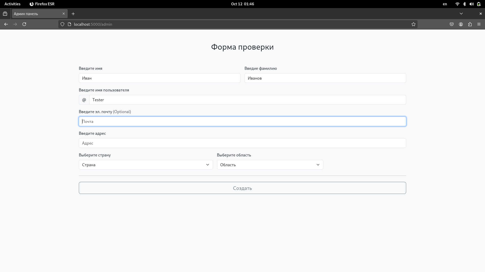

### Подготовка стенда к работе

 * Serving Flask app 'app'
 * Debug mode: off
WARNING: This is a development server. Do not use it in a production deployment. Use a production WSGI server instead.
 * Running on http://127.0.0.1:5000
Press CTRL+C to quit
127.0.0.1 - - [03/Oct/2024 18:57:32] "GET / HTTP/1.1" 200 -
7404
[ WARN:0@2.201] global loadsave.cpp:771 imwrite_ imwrite_('/step-0-passed.png'): can't open file for writing: permission denied

/step-0-passed.png
**Успешно**

# Проверка функциональности тестируемого приложения

## Проверка функциональности первой страницы

### Ввести имя в поле ввода

Step 1: Нажать текст Иван на экране кнопкой left...

Step 2: Поиск текста Иван на экране ...

Найден текст Иван

507 280 34 12

output/example_1/test_greeteng/action_1/step-2-passed.png
**Успешно**

output/example_1/test_greeteng/action_1/step-2-passed.png
**Успешно**

### Нажать кнопку и поздороваться

Step 1: Нажать текст Поздороваться на экране кнопкой left...

Step 2: Поиск текста Поздороваться на экране ...

Найден текст Поздороваться

1304 280 109 16

127.0.0.1 - - [03/Oct/2024 18:58:01] "GET /?name=Тестировщик HTTP/1.1" 200 -

output/example_1/test_greeteng/action_1/action_2/step-2-passed.png
**Успешно**

Step 3: Проверка отображения текста Привет, на экране ...

Найден текст  Админ панель х Привет, мир!

output/example_1/test_greeteng/action_1/action_2/step-3-passed.png
**Успешно**

## Ожидаемый результат: на экране надпись "Привет, Тестировщик!

**Тест пройден**

## эта функция перехода в панель администратора

### переход в панель администратора

Step 1: Нажать текст Перейти на экране кнопкой left...

Step 2: Поиск текста Перейти на экране ...

Найден текст Перейти

871 538 61 16

127.0.0.1 - - [03/Oct/2024 18:58:22] "GET /admin HTTP/1.1" 200 -

output/example_1/test_go_to_admin_panel/action_1/step-2-passed.png
**Успешно**

Step 3: Проверка отображения текста Форма на экране ...

Найден текст  Форма

output/example_1/test_go_to_admin_panel/action_1/step-3-passed.png
**Успешно**

## Ожидаемый результат: пользователь перешел в панель администратора

**Тест пройден**

## эта функция, которая вбивает значения в формы

### Заполнить все формы

Step 1: Нажать текст Имя на экране кнопкой left...

Step 2: Поиск текста Имя на экране ...

Найден текст Имя

327 304 27 12

output/example_1/test_create_note/action_1/step-2-passed.png
**Успешно**

output/example_1/test_create_note/action_1/step-2-passed.png
**Успешно**

Step 3: Нажать текст Фамилия на экране кнопкой left...

Step 4: Поиск текста Фамилия на экране ...

Найден текст Фамилия

982 305 65 12

output/example_1/test_create_note/action_1/step-4-passed.png
**Успешно**

output/example_1/test_create_note/action_1/step-4-passed.png
**Успешно**

Step 5: Нажать текст Пользователь на экране кнопкой left...

Step 6: Поиск текста Пользователь на экране ...

Найден текст Пользователь

367 390 103 12

output/example_1/test_create_note/action_1/step-6-passed.png
**Успешно**

Step 7: Набрать на клавиатуре Tester ...

output/example_1/test_create_note/action_1/step-7-passed.png
**Успешно**

Step 8: Нажать текст Почта на экране кнопкой left...

Step 9: Поиск текста Почта на экране ...

Найден текст Почта

327 476 41 12

output/example_1/test_create_note/action_1/step-9-passed.png
**Успешно**

Step 10: Набрать на клавиатуре email ...

output/example_1/test_create_note/action_1/step-10-passed.png
**Успешно**

Step 11: Нажать текст Адрес на экране кнопкой left...

Step 12: Поиск текста Адрес на экране ...

Найден текст Адрес

325 562 43 16

output/example_1/test_create_note/action_1/step-12-passed.png
**Успешно**

output/example_1/test_create_note/action_1/step-12-passed.png
**Успешно**

Step 13: Нажать текст Страна на экране кнопкой left...

Step 14: Поиск текста Страна на экране ...

127.0.0.1 - - [03/Oct/2024 19:00:19] "GET /admin HTTP/1.1" 200 -
Найден текст Страна

326 638 51 32

output/example_1/test_create_note/action_1/step-14-passed.png
**Успешно**

Step 15: Нажать down 1 раз

Step 16: Нажать enter 1 раз

Step 17: Нажать текст Область на экране кнопкой left...

Step 18: Поиск текста Область на экране ...

Найден текст Область

872 648 61 12

output/example_1/test_create_note/action_1/step-18-passed.png
**Успешно**

Step 19: Нажать down 1 раз

Step 20: Нажать enter 1 раз

### Создать учетную запись

Step 1: Нажать текст Создать на экране кнопкой left...

Step 2: Поиск текста Создать на экране ...

Найден текст Создать

924 740 72 16

127.0.0.1 - - [03/Oct/2024 19:01:34] "POST /admin HTTP/1.1" 200 -

output/example_1/test_create_note/action_1/action_2/step-2-passed.png
**Успешно**

Step 3: Проверка отображения текста Успешно на экране ...

Найден текст  Успешно

output/example_1/test_create_note/action_1/action_2/step-3-passed.png
**Успешно**

## Ожидаемый результат: учетная заипсь создалась "Успешно"

**Тест пройден**

## Результаты тестирования

Тесты завершенные успешно:

* example_1/test_greeteng
* example_1/test_go_to_admin_panel
* example_1/test_create_note

Тесты завершенные неуспешно:

**Всего выполнено**

Успешно: 0003 / Неуспешно: 0000

### Завершение работы стенда

Step 4: Нажать клавишу alt+F4

output/example_1/test_create_note/action_1/action_2/step-4-passed.png
**Успешно**

output/example_1/test_create_note/action_1/action_2/step-4-passed.png
**Успешно**

