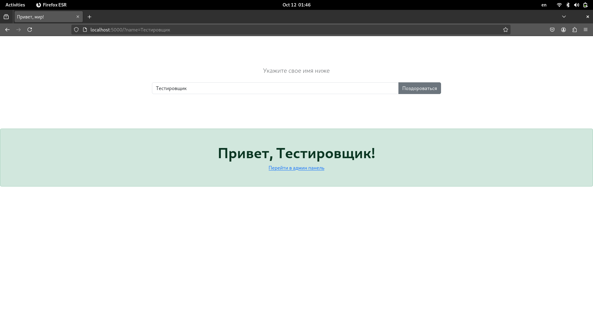
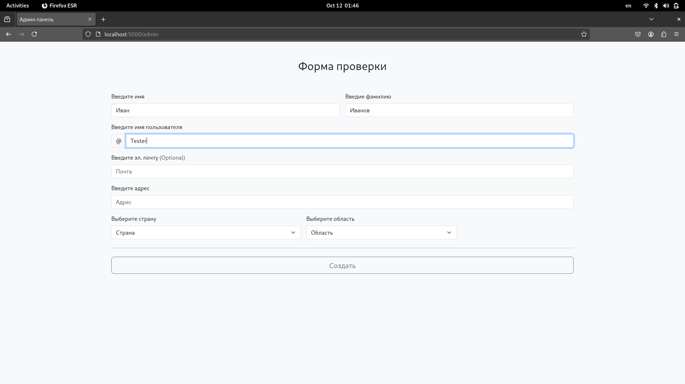
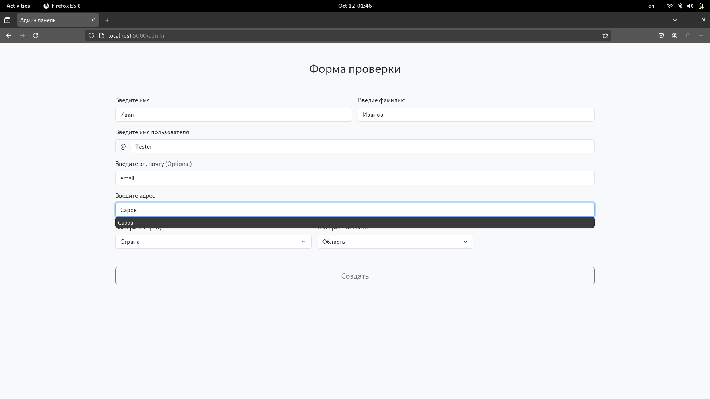
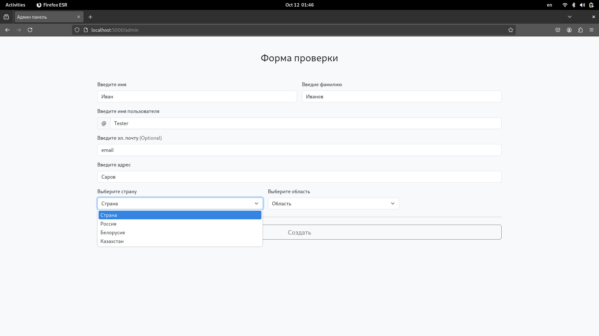
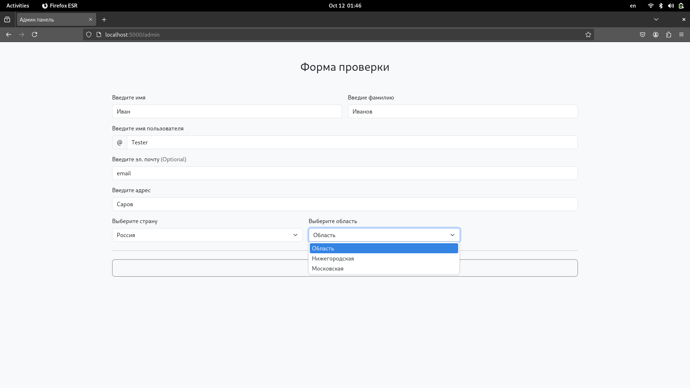

### Подготовка стенда к работе

 * Serving Flask app 'app'
 * Debug mode: off
WARNING: This is a development server. Do not use it in a production deployment. Use a production WSGI server instead.
 * Running on http://127.0.0.1:5000
Press CTRL+C to quit
[21939, Main Thread] WARNING: Locale not supported by C library.
	Using the fallback 'C' locale.: 'glib warning', file ./toolkit/xre/nsSigHandlers.cpp:187

(firefox-esr:21939): Gtk-WARNING **: 01:45:50.310: Locale not supported by C library.
	Using the fallback 'C' locale.
ATTENTION: default value of option mesa_glthread overridden by environment.
ATTENTION: default value of option mesa_glthread overridden by environment.
127.0.0.1 - - [12/Oct/2024 01:45:51] "GET / HTTP/1.1" 200 -
127.0.0.1 - - [12/Oct/2024 01:45:51] "GET /favicon.ico HTTP/1.1" 404 -
21939

**Успешно**

# Проверка функциональности тестируемого приложения

## Проверка функциональности первой страницы

### Ввод имени в поле ввода

Step 1: Нажать текст Иван на экране кнопкой left...

Step 2: Поиск текста Иван на экране ...

Найден текст Иван

507 280 34 12

**Успешно**

**Успешно**

### Нажатие на кнопку  поздороваться

Step 1: Нажать текст Поздороваться на экране кнопкой left...

Step 2: Поиск текста Поздороваться на экране ...

Найден текст Поздороваться

1304 280 110 16

127.0.0.1 - - [12/Oct/2024 01:46:02] "GET /?name=Тестировщик HTTP/1.1" 200 -

**Успешно**

Step 3: Проверка отображения текста Привет, на экране ...

Найден текст  + Привет, мир! [5]

**Успешно**

## Ожидаемый результат: на экране надпись "Привет, Тестировщик!

**Тест пройден**

## Проверка перехода в панель администратора

### переход в панель администратора

Step 1: Нажать текст Перейти на экране кнопкой left...

Step 2: Поиск текста Перейти на экране ...

Найден текст Перейти

871 538 61 16

127.0.0.1 - - [12/Oct/2024 01:46:04] "GET /admin HTTP/1.1" 200 -

**Успешно**

Step 3: Проверка отображения текста Форма на экране ...

Найден текст  Форма

**Успешно**

## Ожидаемый результат: пользователь перешел в панель администратора

**Тест пройден**

## Проверка создания учетной записи

### Заполнение всех форм

Step 1: Нажать текст Имя на экране кнопкой left...

Step 2: Поиск текста Имя на экране ...

Найден текст Имя

326 304 28 12

**Успешно**

**Успешно**

Step 3: Нажать текст Фамилия на экране кнопкой left...

Step 4: Поиск текста Фамилия на экране ...

Найден текст Фамилия

982 304 65 13

**Успешно**

**Успешно**

Step 5: Нажать текст Пользователь на экране кнопкой left...

Step 6: Поиск текста Пользователь на экране ...

Найден текст Пользователь

367 390 103 12

**Успешно**

Step 7: Набрать на клавиатуре Tester ...

**Успешно**

Step 8: Нажать текст Почта на экране кнопкой left...

Step 9: Поиск текста Почта на экране ...

Найден текст Почта

327 476 41 12

**Успешно**

Step 10: Набрать на клавиатуре email ...

**Успешно**

Step 11: Нажать текст Адрес на экране кнопкой left...

Step 12: Поиск текста Адрес на экране ...

Найден текст Адрес

325 562 43 16

**Успешно**

**Успешно**

Step 13: Нажать текст Страна на экране кнопкой left...

Step 14: Поиск текста Страна на экране ...

Найден текст Страна

326 648 51 16

**Успешно**

Step 15: Нажать down 1 раз

Step 16: Нажать enter 1 раз

Step 17: Нажать текст Область на экране кнопкой left...

Step 18: Поиск текста Область на экране ...

Найден текст Область

873 648 60 12

**Успешно**

Step 19: Нажать down 1 раз

Step 20: Нажать enter 1 раз

### Создание учетной записи

Step 1: Нажать текст Создать на экране кнопкой left...

Step 2: Поиск текста Создать на экране ...

Найден текст Создать

924 740 72 16

127.0.0.1 - - [12/Oct/2024 01:46:27] "POST /admin HTTP/1.1" 200 -

**Успешно**

Step 3: Проверка отображения текста Успешно на экране ...

Найден текст  Успешно

**Успешно**

## Ожидаемый результат: учетная запись создалась "Успешно"

**Тест пройден**

## Результаты тестирования

Тесты завершенные успешно:

* example_1/test_greeteng
* example_1/test_go_to_admin_panel
* example_1/test_create_note

Тесты завершенные неуспешно:

**Всего выполнено**

Успешно: 0003 / Неуспешно: 0000

### Завершение работы стенда

Step 4: Нажать клавишу alt+F4

**Успешно**

**Успешно**

